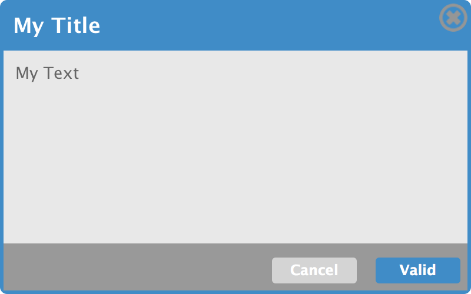

## Custom Widget for [Wakanda](http://wakanda.org)
The Modal Dialog widget allows you to have a simple modal dialog box loaded in the center of your window.

### Properties
- ID : ID of the widget
- Hide Widget On Load : Hide the widget on the load of the page (true by default : the checkbox is not checked in the GUI Designer but the modal dialog is hide in the code at runtime).
- Text : The text displayed in the modal dialog.
- Title : The title of the modal dialog.
- Validation Button Text : The text displaying in the validation button (Valid, Accept, Agree, Ok, Yes).

### Event
*Validation Button :*
- On Click : This event allow you to have your own code when the validation button is clicked

### Methods
- openDialog() : Display the dialog widget in the center of your page.
- closeDialog() : Close the dialog.
- setTitle(value) : Set the title value.
- setText(value) : Set the text displayed in the widget.

###Default Style

You can define your how style in the css/widget.css file

### More Information
For more information on how to install a custom widget, refer to [Installing a Custom Widget](http://doc.wakanda.org/WakandaStudio0/help/Title/en/page3869.html#1027761).

For more information about Custom Widgets, refer to [Custom Widgets](http://doc.wakanda.org/Wakanda0.v5/help/Title/en/page3863.html "Custom Widgets") in the [Architecture of Wakanda Applications](http://doc.wakanda.org/Wakanda0.v5/help/Title/en/page3844.html "Architecture of Wakanda Applications") manual.
