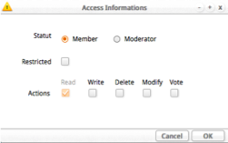
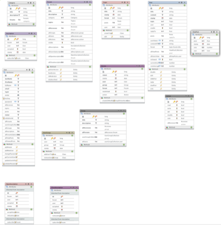

#Wakanda Forum Application
#Documentation
##Introduction

This documentation will explain different side of this webApp :

* Quick Start, the first step to setup the webApp.
* The rules of the forum and how the webApp work on a browser.
* And the business rules of the webApp will be the part for the people who want to know more !about the code.

##Definition

This webApp is a simple forum where people can exchange messages. It is a generic forum and the rules are basics. You can extend or modify this webApp for your own needs with your own business rules if needed.

##Quick Start

You will find a file called **QuickStart.js** located in the root of the project.

In this file you have to define different parameters :

* *forumTitle* : name of the webApp,
* *validationByEmail* : to define the way to validate a new member,
* *mailSettings* : to define the smtp server that need to be used for sending emails,
* *postViewTimeout* : to define the number of days after which a message is considered as read.

Then run the file. It will create all the default groups to start the webApp :

* **public** : group that have an access without a login,
* **member** : group for all the people with a login,
* **dataAdmin** : group with a full admin access (administrator).

It will create a default Administrator user (login : administrator, password : admin1234)

It will create a forum’s category “Public Forums”, a forum “Public Forum” and a first welcome Thread “Welcome to the forum”. And finally will define a public access for this forum.

##Rules of the forum
###Management Page
This page is accessible through the url *http://yourIPAddress:PortNumber/management*
This page will provide you all the administration tools to define the **Users & Groups, Accesses and Categories & Forums**.

You must login with the Administrator user created previously by the **Quickstart.js** or a user binded to the dataAdmin group (see below).

####Users & Groups
This is where you can create, modify or delete manually different users and groups. You can also assign users to different groups.

####Accesses
This is where you can define an access to a specific forum for a group and/or a user.
#####1. Forums
This is where you can see the access privilege for every forums, sorted by categories.
#####2. Groups
This is where you can see all the groups and create a access for a group. To do that you must select a specific forum, a specific group and clic the button “Create an access for this group”.

#####3. Users
This is where you can see all the users and create a access for a user.
To do that you must select a specific forum, a specific user and clic the button “Create an access for this user”.

When you click the button to create the access, you will get a dialog window to define the **Statut**, if the access must be **restricted** and the **actions** privileges.

A user can be a simple **Member** or a **Moderator**.

A moderator can modify threads and posts. He can enable or disable a post. He can manage subscriptions.
By default the read action is set for all the accesses (public, member and moderator).

This array show the difference between the member and the moderator.

|           |         Read        |          Write          |          Delete         |          Modif          |           Vote          |
|:---------:|:-------------------:|:-----------------------:|:-----------------------:|:-----------------------:|:-----------------------:|
| **Moderator** | All Threads & Posts |   All Threads & Posts   |   All Threads & Posts   |   All Threads & Posts   | His own Threads & Posts |
|   **Member**  | All Threads & Posts | His own Threads & Posts | His own Threads & Posts | His own Threads & Posts | His own Threads & Posts |

The public group have only a read access.

**Restricted** option can override all the other privilege accesses for a group or a user (*lowest common denominator*)

####Categories and Forums
This is the place where you can see all your forums. You can choose a category and then look at all the forums, threads and posts. You can modify, create or remove them when needed.

###Registration to the forum
There is two different processes for registration : with email validation or without. This has been defined in the **QuickStart.js** file but you can change this setting in the *forumSettings.json* file located in *root/forumSettings/*

###Accesses
Only a user from the dataAdmin group (administrator) can create and modify the accesses.

###Subscription for a specific forum
A member can subscribe to a specific forum if this one is set visible by the administrator and if he has not yet any accesses. Once the moderator accept the request, the user will have all the accesses to the forum subscribed (in future version, the moderator will be able to change the access for his own moderated forums. Now only the administrator can manage forum’s accesses).

##How to use

Without any login, you can only read the content of public forums.

If you are a member, you can see all the forums which are set visible and if you have no authorisations (grey background) you can ask to subscribe to them. You will get a dialog to confirm your subscription.

###Action button

At the bottom of the page, you have different buttons, depending of your privilege access and depending of the context.

Preference :

* if you are an admin, and if you are in the category list, you can add/delete or modify a category.
* if you are an admin, and if you are in the forum list, you can add/delete or modify a forum.
* if you are an admin or a moderator, and if you are in the thread or post list, you can modify a
thread or a post. You can disable or enable a post. And you can manage the subscription list of users.

This button allow to add a Thread or a Post.

This button allow you to disable only you own post if you are not a moderator.

This button allow you to edit your own post if you are not a moderator.

This button gives you an access to your account settings and to the list of all your
threads and posts.

##Business Rules

###User and Group
In this WebApp we manage the user and group directly in our model.

But we use the directory to manage permission on dataClass and the admin account to handle the solution (start/stop/debug).

This is how the directory is set up :

|              Name              |                    Role                    |      Group     |
|:------------------------------:|:------------------------------------------:|:--------------:|
|   Admin Password : admin1234   |           Admin for the solution           |      Admin     |
| dataAdmin Password : admin1234 |             Admin for the data             | Administrateur |
|                                | Default group for the members of the forum |      User      |

The dataAdmin account in the directory must not be used to navigate through the WebApp. It is intended to be used only for the data management (Data Browser). In the **QuickStart.js**, an administrator account is created to be used for managing the WebApp. With this user account you can create threads and posts.

###Model

All dataClasses have set the Administrateur (I call it Administrateur because I start the programmation in french) group’s permission, for creating, updating and removing. This is set to allow only our own methods to do specific action on dataClasses.

###List of all dataClasses

####Category
A category contains many forums. Only a DataAdmin can manage categories.

####Forum
A forum contains many threads. Only a DataAdmin can manage forums.

*Methods : getUserAccess(), hasAccess(), isModerator(), isSubscribed(). For more details, look at the code of the methods.*

####Topic
A topic is a thread (I call it topic because I start the development in french). A topic can contains many posts. Anybody who have a write access to a forum can create a new thread. Only the owner of a thread or the moderator of the forum can modify a thread.

*Methods : createTopic(), edit(). For more details, look at the code of the methods.*

####Post
A post can be created by any user of the forum who have the write access.

*Methods : disable(), edit(), isMyPost(), reply(), viewPost(), vote(). For more details, look at the code of the methods.*

####User
This dataClass contains all the users.

*Methods : addAvatar(), addNewUser(), changePassword(), getCurrentUserID(),
updateUserInfo(), validatePassword() set public on server. For more details, look at the
code of the methods.*

####Group
All the groups.

By default this dataClass contain 3 groups :

* dataAdmin : The Super Admin. The users in this group have the global access for all the data of
the webApp.
* public : This group is only used to set a simple read access for people who are not logged.
* member : This group contain all the users.

####UserGroup
This is a utility dataClass (N-N)

*Methods : addUserToGroup(), removeUserInGroup(). For more details, look at the code of the methods.*

####Access
This dataClass define the access for Users OR Groups for a specific forum.

*Methods : createOrModifyAGrouporUserAccess(). For more details, look at the code of the method.*

####Action
This is where you can define different action’s privileges available for the forums (E.g. : read, write, del, modify, vote).

####Inscription
This dataClass contains all the subscriptions. (I call it Inscription because I start the development in french)

*Methods : subscribeToForum(). For more details, look at the code of the method.*

####OpenInscription
This dataClass inherit from the Inscription dataClass and contains all the subscription not yet validated.

"Methods : acceptInscription(), refuseInscription(). For more details, look at the code of the methods."

####CloseInscription
This dataClass inherit from the Inscription dataClass and contains all the validated subscription.

*Method : removeInscription(). For more details, look at the code of the method.*

####ViewPost
We store post read by users and possible votes.

###Modules

In the root project there is three modules : namespace, RPCUtils, xbbcode.

####namespace
This js file contains all the methods used on the server side : 

* validateEmail()
* sendMail()
* all the Getters and Setters for the forumSettings.

For more details, look at the code of the methods.

####RPCUtils
This js file contains all the methods used on the client side via RPC :

* isDataAdmin()
* testUrl()
* some Getter for the forumSettings : getPublicGroupID(), getValidationByEmail(),
getForumTitle().

For more details, look at the code of the methods.

####xbbcode
This is a module from Patrick Gillepsie (http://patorjk.com/). It is a javascript BBCode parser used on the server side and client side via RPC. It’s actually restricted to some limited bbcode tags.

###Registration

When a user want to create his own account, the method on the User dataClass addNewUser() is called. Depending of the general forumSettings, the validation process is done by email containing a validation url, or validated right away.

The request handler */root/emailconf.js* is handling the validation url to confirm the registration.

###Authentication type
The solution settings is set with Custom Authentication type.
You can found the customLoginListener() in the required.js in the root of the solution folder.

##License

The MIT License (MIT)

Copyright (c) 2014 AJAR SA : [http://www.ajar.ch](http://www.ajar.ch "http://www.ajar.ch")

Permission is hereby granted, free of charge, to any person obtaining a copy of this software and associated documentation files (the "Software"), to deal in the Software without restriction, including without limitation the rights to use, copy, modify, merge, publish, distribute, sublicense, and/or sell copies of the Software, and to permit persons to whom the Software is furnished to do so, subject to the following conditions:
The above copyright notice and this permission notice shall be included in
all copies or substantial portions of the Software.

THE SOFTWARE IS PROVIDED "AS IS", WITHOUT WARRANTY OF ANY KIND, EXPRESS OR IMPLIED, INCLUDING BUT NOT LIMITED TO THE WARRANTIES OF MERCHANTABILITY, FITNESS FOR A PARTICULAR PURPOSE AND NONINFRINGEMENT. IN NO EVENT SHALL THE AUTHORS OR COPYRIGHT HOLDERS BE LIABLE FOR ANY CLAIM, DAMAGES OR OTHER LIABILITY, WHETHER IN AN ACTION OF CONTRACT, TORT OR OTHERWISE, ARISING FROM, OUT OF OR IN CONNECTION WITH THE SOFTWARE OR THE USE OR OTHER DEALINGS IN THE SOFTWARE.
